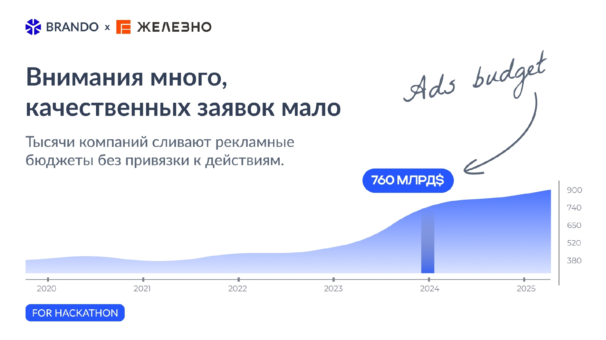
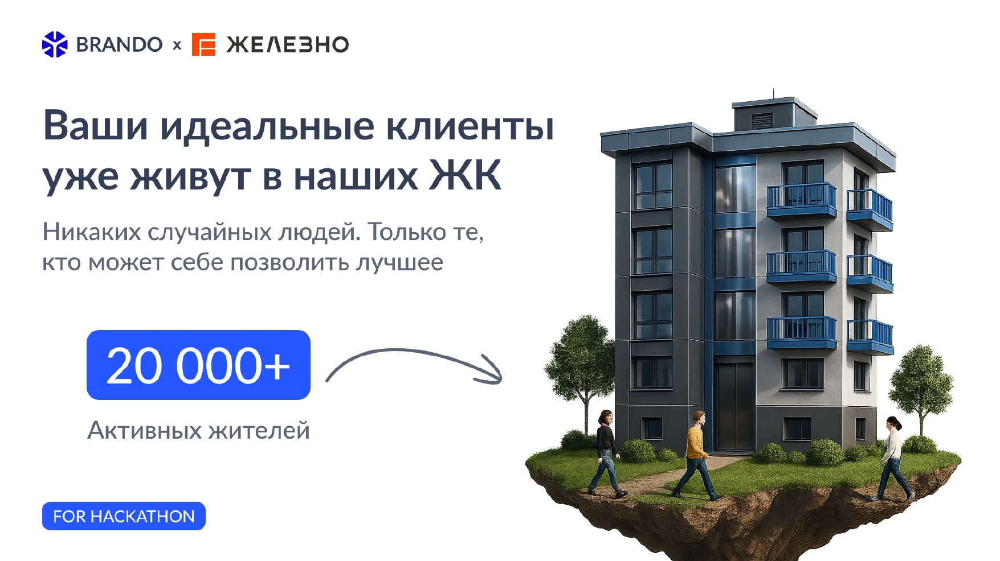
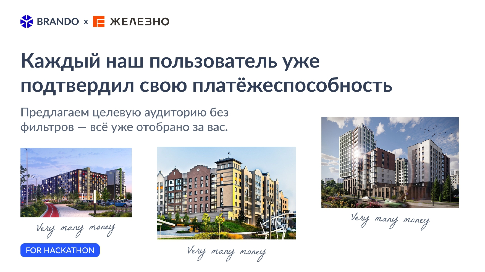
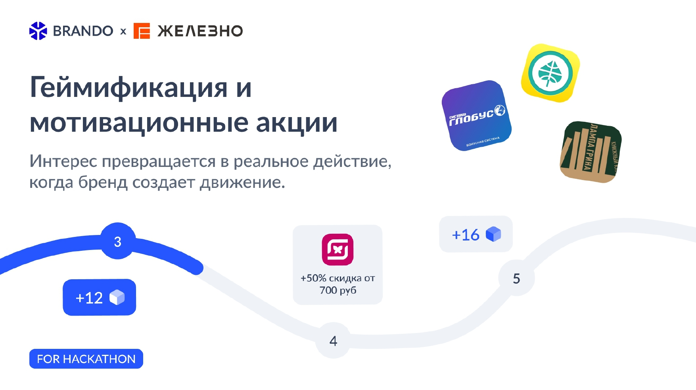
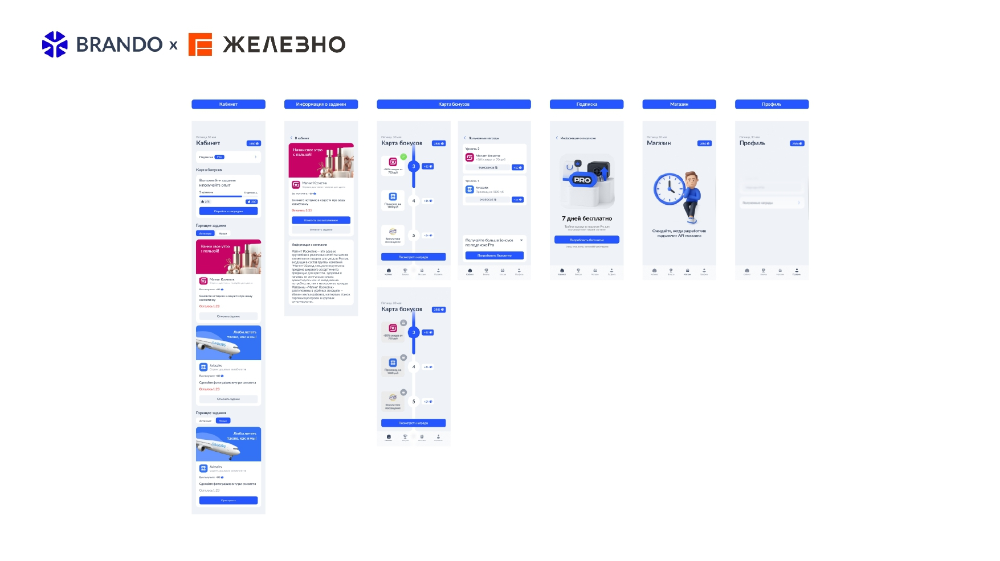
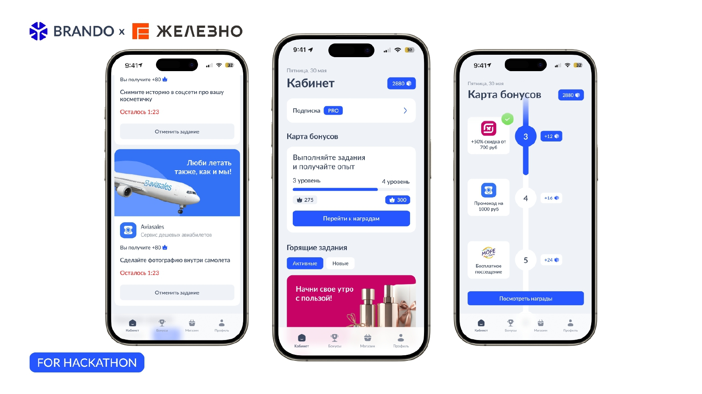
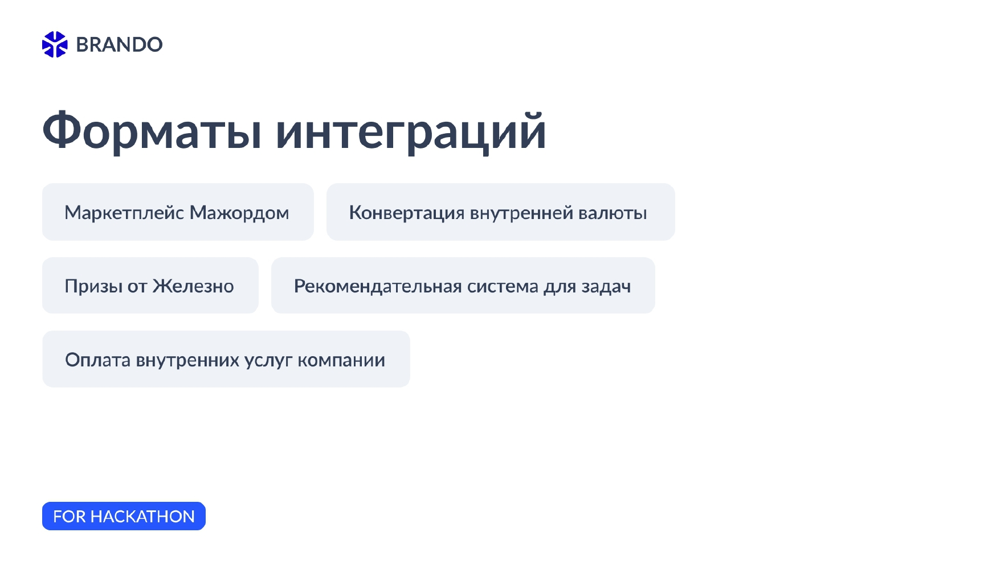

# Brando

**Brando** — геймифицированная платформа, которая помогает брендам взаимодействовать с жителями жилых комплексов через конкретные задания и мотивационные механики.

Партнёры размещают задания, связанные с продуктом или услугой, а пользователи выполняют их, получают опыт, внутренние бонусы и вознаграждения. Такой формат превращает обычную рекламу в измеримое целевое действие и помогает брендам формировать базу заинтересованных клиентов.

## Демо

[Открыть развернутое приложение](https://ddisb.github.io/Stainless-Hackathon/)

## Основные возможности

- задания и рекламные активности от партнёров;
- система уровней, опыта и внутренней валюты;
- бонусы, скидки и призы за выполнение заданий;
- рекомендательная система для подбора активностей;
- сбор результатов взаимодействия и контактных данных пользователей;
- интеграция с внутренними сервисами и партнёрскими площадками.

## Презентация проекта

---

  
  
---

  
  
---

  
  
---

  
  
---

  
  
---

  
  
---

  
  
---

  
  
---

  
  
---

  
  
---

  
  
---

  
  
---
